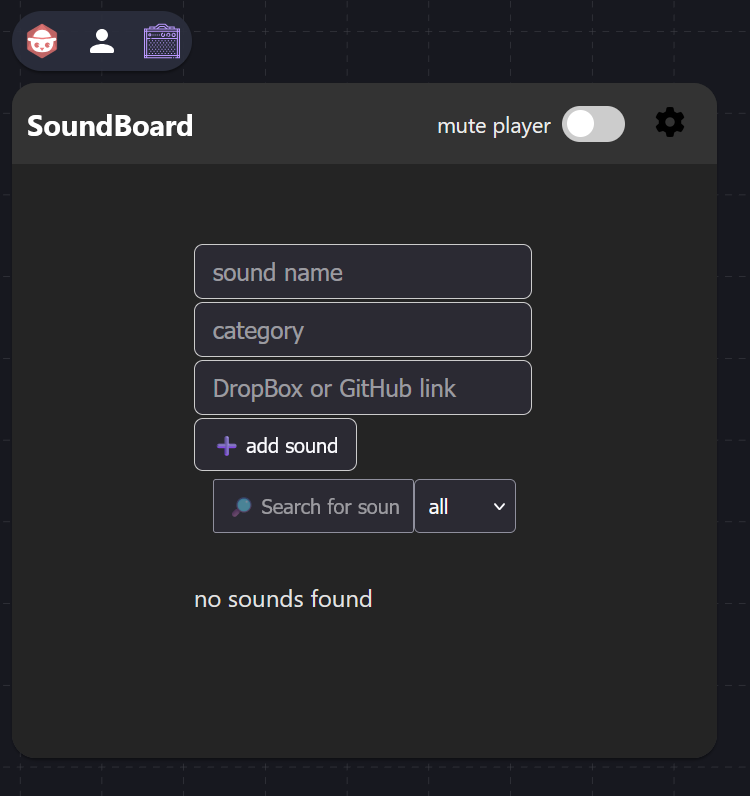
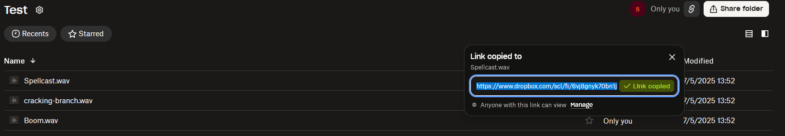
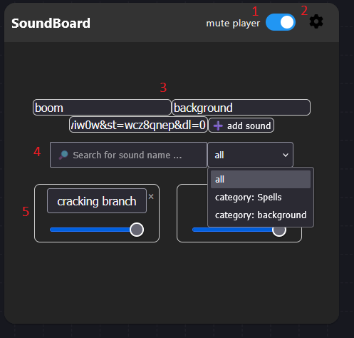
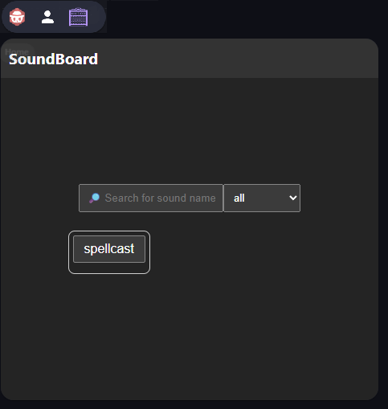

# SoundBoard

SoundBoard Extension for OwlBear Rodeo to play custom sounds in the room.

## Installing

Copy and add `https://soundboard-ecb.pages.dev/manifest.json` to your extensions in your Owlbear Rodeo profile.

## Why do I need this?

You may ask, why do I need a sound board in OwlBear? I already have [Tracks](https://extensions.owlbear.rodeo/tracks) and [Djinni Music player](https://extensions.owlbear.rodeo/djinni-music-player). Yeah that's right and I (as a GM) love those two as I belive in the 60/40 rule of sound and imagination. ([the power of sounds](https://www.tiktok.com/@bardsofnewyork/video/7431326761033403678))
But I faced some situations where [Tracks](https://extensions.owlbear.rodeo/tracks) and [Djinni](https://extensions.owlbear.rodeo/djinni-music-player) couldn't help me out.
Example 1: *Your players stumble through a dark forest trying to find the path they lost, when suddenly they hear a crack in the bushes.* And now you want them to hear that crack. That's when the SoundBoard extension hits in. Simply click on your sound and everyone will hear the sound.
Example 2: *On their way of finding a child in huge castle your party walks by a locked door. One of the party members is pretty good in hearing noises or sensing people, so you want him to hear a whimper or sob.* Now you can pass that sound just to this player in hope he will sensor it and ask the others if they heard it.
Additionally, you can combine [Tracks](https://extensions.owlbear.rodeo/tracks) or [Djinni](https://extensions.owlbear.rodeo/djinni-music-player) and this SoundBoard so you don't have to stop playing the background music to make a noise. By clicking a sound, it will automatically mix under the already playing sound which makes the experience even better.

## How it Works

The SoundBoard allows the GM to add DropBox links and play them for their players. You can add noises, sounds, music, etc. All you need is a DropBox account and the corresponding sounds. Personaly I'd reccomend this page https://pixabay.com/de/sound-effects/ to find new soundeffects.

### Initial GM View

Clicking the  icon at the top of the page will open the SoundBoard.

You can see by default there are noch initial sounds set, so it belongs all to you as GM to add or import new sounds. To do so, all you need is a shared DropBox link of a sound. (Maybe I'll expand this in the future to other Services, but for now only DropBox is supported.)

Once you've copied the link to your clipboard, paste it in the OwlBear extension together with a name and a category of your sound and click "➕ add sound". That's it, now you have a new sound in your sound board, ready to play.

### Filled GM View

1. For sure at some point you as GM will be annoyed by alle the players hitting sounds. If this happens you can just mute them out.

2. The settings-wheel provides usefull import and export functions for the extension. At first there is "export permissions", where you can export the individual permissions for the players. E.g. Spy has access to "cracking branch" and Wizard has no access at all. Then you can export these permissions and import them for another room. Second, there is "export sounds", where you can export the stored sounds. E.g. You as GM have imported ten sounds and now, since you have done all the work, you don't want to do it again for the next party. Then simply export your sounds and import them in the other room.
IMPORTANT NOTE: If you export permissions -> delete a sound -> import permissions, your players would have access to a sound that no longer exists. I've tried to handle this situation by filtering out these delete sounds. However, this may cause unusual behavior, so please be aware of this.
Note: In general you don't have to make backups of your sounds and permissions since they are stored in the metadata of you room. So these functions are only neccessary if you want to change OwlBear rooms with your party or transfer your settings to other rooms.

3. Here you can add your new sounds. As stated above on default your GM-View is empty so you need to add sounds on yourself. You have to input all fields otherwise you can't import your sound. If you have inserted all data, simply click the "➕ add sound" button and that's it.

4. I don't know how much sounds you want to use, but over the time it can increase a lot. Therefore, searching and filtering would be neccessary I guess.

5. Here you can see your already imported sounds together with a Volume-Slider. The Slider (5.2) is individual for all sounds, so the GM can set them in general. If you click a sound (5.1) it will play in the whole room, so everyone will hear it. The same belogns to the players. If you as GM provided access to a sound and a player clicks the button everyone in the room will hear it (and now you know why the "mute player"-Slide (1.) is so important ^^). Additionally, you can delete sounds by clicking the little "x" in the top right corner of each sound-button. *Caution! see IMPORTANT NOTE of step 2*
If you don't want a sound to play in the whole room but for one player specifically, you can hit the player name (5.3). E.g. you want the Spy to hear a cracking branch? Hit the "Spy" button (5.3) below the volume slider (5.2) and you (as GM) and the Spy will hear this sound.
If you want to provide access to a sound to one or more of your players you can do that by ticking the checkboxes (5.4). E.g. you want to allow the Wizard to play the "spellcast" sound? Tick the checkbox and the Wizard will see this sound in his soundboard. Note that if a player clicks a sound, everyone in the room will hear it.

### Filled Player View

## Troubleshooting

If you face any issues feel free to message me in the [DiscordChannel](https://discord.gg/UY8AXjhzhe) or DM me via Discord. You can also make Pull-Request and comment the code, I tried my very best to commend it properly.

And That's it. I hope you like it and have fun. If you have further suggestions for improvement feel free to message me in the OwlBear Discord Channel or comment here on Git.

Copyright (C) 2025 Monkshoody