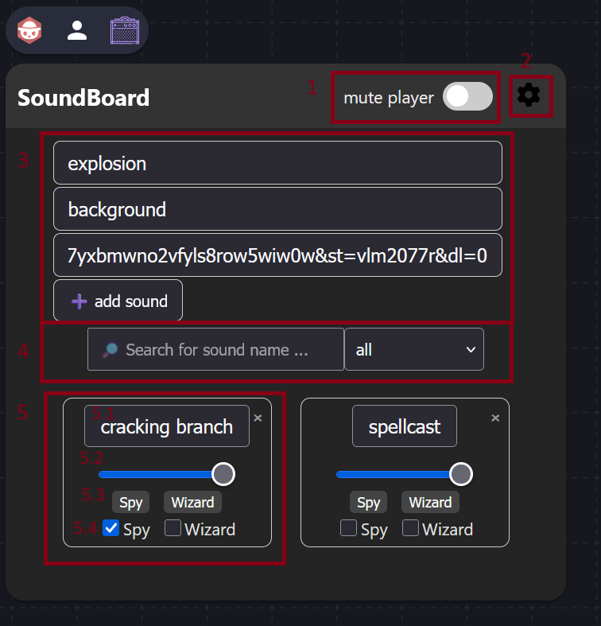

# 🎵 SoundBoard

An extension for Owlbear Rodeo that allows you to play custom sounds directly in the room.

## 🚀 Installing

Simply add the following link to your Owlbear Rodeo profile under “Extensions”: https://soundboard-ecb.pages.dev/manifest.json

## ❓ Why do I need this?

You might be wondering, "Why another soundboard? I already have [Tracks](https://extensions.owlbear.rodeo/tracks) and [Djinni Music player](https://extensions.owlbear.rodeo/djinni-music-player)! Yeah that's right and as a GM I love those two as I belive in the 60/40 rule of sound and imagination ([the power of sounds](https://www.tiktok.com/@bardsofnewyork/video/7431326761033403678)). But they have their limitations.

### Example 1

*Your players stumble through a dark forest trying to find the path they lost, when suddenly they hear a crack in the bushes.* And now you want them to hear that crack. That's when the SoundBoard extension hits in. Simply click on your sound and everyone will hear the sound.
### Example 2:

*On their way of finding a child in huge castle your party walks by a locked door. One of the party members is pretty good in hearing noises or sensing people, so you want him to hear a whimper or sob.* Now you can pass that sound just to this player in hope he will sensor it and ask the others if they heard it.
### Combinable:

Additionally, there is no need to pause the background music! The SoundBoard automatically mixes the sound into the music playing – for an even more immersive gaming experience.

## ⚙️ How it Works

The SoundBoard allows game masters to add sound links (currently only via Dropbox) and play them specifically.
Recommendation for sound effects: pixabay.com/sound-effects

### 🥸 Initial Game Masters View

Clicking the  icon at the top of the page will open the SoundBoard.

You can see by default there are noch initial sounds set, so it belongs all to you as GM to add or import new sounds. To do so, all you need is a shared DropBox link of a sound. (Maybe I'll expand this in the future to other Services, but for now only DropBox is supported.)

1. Copy a shared Dropbox link to your desired sound.
2. Paste it into the SoundBoard – including the name and category.
3. Click "➕ add sound" – done!

### 🧙 GM View

1. Mute players:
Prevent chaos by muting players who are too game-oriented 😉

2. Import/Export:
Export permissions: Save individual player permissions (e.g., "Spy can play cracking," "Wizard can play nothing").
Export sounds: Save your painstakingly compiled sound library for other rounds.
⚠️ Important: If you export permissions, then delete a sound, and later re-import permissions, problems can arise. I try to filter such conflicts automatically—but it's not 100% safe.

3. Add new sounds:
Fill in the fields → click “➕ add sound” → off you go.

4. Search & Filter:
The more sounds you have, the more useful this feature becomes.

5. Sound overview & controls:
5.1 🎚️ Each sound has its own volume control.
5.2 ▶️ Click on a sound → everyone hears it.
5.3 👤 Click on a player name → only that player (and you) hears it.
5.4 ☑️ Checkboxes → control who can play which sound.
5.5 ❌ Small "x" → delete sound. ⚠️ *Caution! see Important note of step 2*

Here you can see your already imported sounds together with a Volume-Slider. The Slider (5.2) is individual for all sounds, so the GM can set them in general. If you click a sound (5.1) it will play in the whole room, so everyone will hear it. The same belogns to the players. If you as GM provided access to a sound and a player clicks the button everyone in the room will hear it (and now you know why the "mute player"-Slide (1.) is so important ^^). Additionally, you can delete sounds by clicking the little "x" in the top right corner of each sound-button. 
If you don't want a sound to play in the whole room but for one player specifically, you can hit the player name (5.3). E.g. you want the Spy to hear a cracking branch? Hit the "Spy" button (5.3) below the volume slider (5.2) and you (as GM) and the Spy will hear this sound.
If you want to provide access to a sound to one or more of your players you can do that by ticking the checkboxes (5.4). E.g. you want to allow the Wizard to play the "spellcast" sound? Tick the checkbox and the Wizard will see this sound in his soundboard. Note that if a player clicks a sound, everyone in the room will hear it.

### 👀 Player View

Players only see the sounds they have been granted access to. They can play them back, making them audible throughout the room.

## 🛠️ Troubleshooting

Problems? Questions? Ideas?
Message me directly on [DiscordChannel](https://discord.gg/UY8AXjhzhe)
Or comment on the GitHub repository
Pull requests are always welcome! I tried my very best to commend properly.

Thanks for using the SoundBoard – I hope it adds even more atmosphere and fun to your group.
Happy leading!

© 2025 Monkshoody